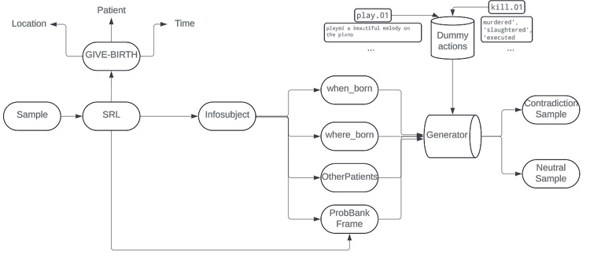

# Adversarial Natural Language Inference Homework

## Overview
This repository hosts materials for the Homework 2 of the NLP 2024 course, focusing on Adversarial Natural Language Inference (NLI). The objective of this assignment is to enhance the complexity of a standard NLI dataset by introducing adversarial examples that test the robustness of various NLI models.

## Experiments
- **Substitution of Negations:** A preliminary experiment where 'is not' is replaced with 'is', alongside appropriate adjustments in the corresponding labels to create challenging NLI instances.
- **Synonym and Hypernym Substitution:** This experiment involves the substitution of words in the hypotheses with their synonyms or hypernyms, thereby preserving the original intent but altering the phrasing.
- **Word Sense Disambiguation (WSD):** This approach incorporates definitions from WordNet to introduce semantic "noise", aiming to challenge the model's ability to maintain accuracy under linguistically complex conditions.
- **Generated Samples:** This method utilizes temporal consistencies to construct new samples without employing any large language models (LLMs).

  
